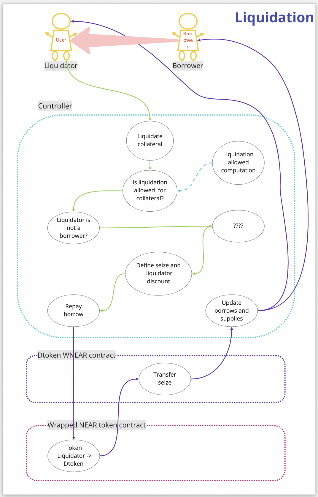

# Liquidation

## **What is liquidation?**

Liquidation is the process of terminating a borrower's account when their Health factor goes below 100%, and their collateral value does not fully cover their loan value. This might occur when the collateral decreases in value or the loan debt increases in value against each other. You can learn more about how the Health factor is calculated lower on the page, in the Health factor part.

## **How does liquidation work?**

## **Liquidation threshold**

The liquidation threshold is the percentage at which a position is defined as undercollateralized. For example, a liquidation threshold of 95% means that if the value rises above 95% of the collateral, the position is undercollateralized and could be liquidated.

## Liquidation Bonus

A liquidation bonus is a special reward that depends on the price of assets of the collateral. It is allocated when liquidators purchase it as part of the liquidation of a loan that has passed the liquidation threshold.

## Health factor

The Health factor is a numeric representation of the safety of your deposited assets against the borrowed assets and their underlying value. It is computed per account instead of per asset.

Each account may have multiple collateral asset supplies and may borrow multiple assets. Each market has a configuration value volatility ratio which indicates the expected price stability score. The higher the ratio, the higher expectation of the stability of the price of the corresponding asset.

$$
Collaterals_{affected} = \sum_{i=0}^{n}{Collaterals_i*Price_i* Volatility Ratio_i}\\ Borrows_{affected} = \sum_{i=0}^{n}{Borrows_i*Price_i* Volatility Ratio_i}\
$$

Now we can compute the Health factor:

$$
H_{fact}= \frac{Collaterals_{affected}}{Borrows_{affected}}\
$$

If the Health factor is higher than 100%, it means that the account is in good shape and can't be liquidated.

If the Health factor is less than 100%, it means the account can be partially liquidated and can't borrow more without repaying some amount of the existing loans or providing more collateral assets.

## Liquidation flow

Contract liquidations are designed to make liquidators compete for the profit that they make during liquidations to minimize the loss taken by the unhealthy accounts. Instead of the fixed profit that is used in the legacy products, this contract introduces a variable discount with variable liquidation size.

> Liquidations rules:
>
> * the initial Health factor of the liquidated accounts has to be below 100%
> * the discounted sum of the taken collateral should be less than the sum of repaid assets;
> * the final Health factor of the liquidated accounts has to stay below 100%.

A liquidation action consists of the following:

> * account\_id - the account ID that is being liquidated
> * in\_asset - the assets and corresponding amounts to repay form borrowed assets
> * out\_asset - the assets and corresponding amounts to take from collateral assets

The discount is computed based on the initial Health score of the liquidated account:

$$
Discount = \frac{(1 - H_{fact})}{2}\
$$

Now, we can compute the taken discounted collateral sum and the repaid borrowed sum:

$$
Taken\_sum = \sum_{i=0}^{n}{(out\_asset_i * price_i)} \\Discounted\_collateral\_sum = taken\_sum * (1 - discount) \\ Repaid\_sum =\sum_{i=0}^{n}{(in\_asset_i * price_i)}
$$

Once these calculations are done, we can compute the final values and verify the liquidation rules:

* health\_factor < 100% (to liquidate only unhealthy accounts);
* discounted\_collateral\_sum <= repaid\_sum (to prevent from taking more collateral than the repaid sum (after discount));
* new\_health\_factor < 100% (to prevent the liquidator from repaying too much of the borrowed assets).
