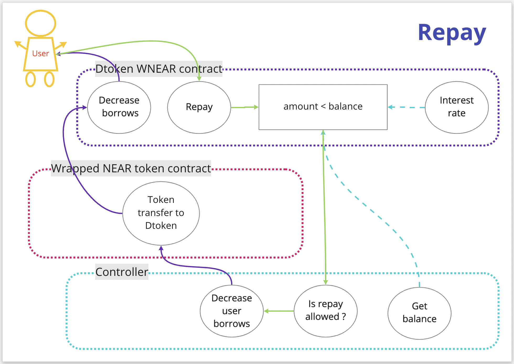

# Repay

## How do I repay with my collateral/deposits?

To produce repay with your assets, please go to the Dashboard and follow the next steps:

* Click on the borrow button on the asset you want to repay.
* Choose repay tab in an appeared modal window
* There you will find your loan information with accrued percents
* Please submit repay transaction by clicking on Repay button at the bottom of the modal 
 
At the early stage the protocol support repay in the same asset the borrow was created.

## How does repayment work?

