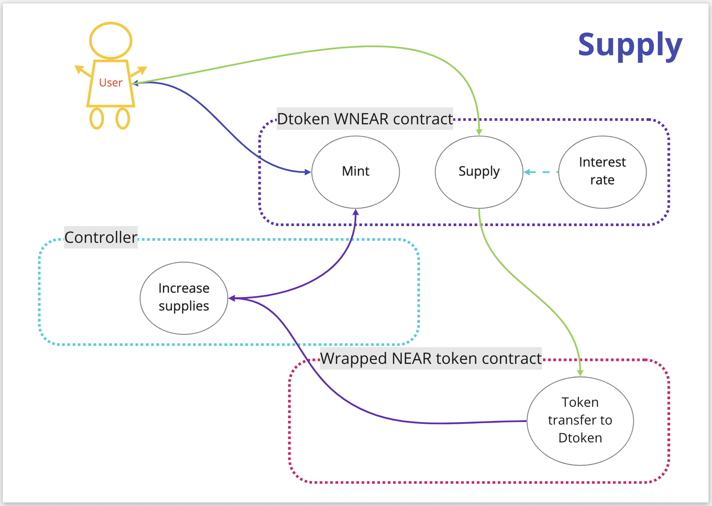

# Deposit & Earning

## How do I deposit

Before you want to make a deposit, you should connect a wallet. You can do it via the "Connect wallet" button on the main page of the application. After, please find an asset that you wanna supply and click "Supply", select the amount you'd like to deposit in an appeared modal window and submit your transaction. Once the transaction is confirmed, your deposit is successfully registered and you begin earning interest.

***

## What's the profit ?

Once your deposit will be supplied, your account will be rewarded by `dTokens`. `dTokens` holders receive continuous earnings that evolve with market conditions. You can look at the Interest Model category to find out how does it work more precisely.
 
Also, after the native token integration and DAO implementation, the protocol with provide incentivisation for the market supply, thus encouraging user to provide the liquidity.
 
At later stages the prtocol will provide user the instrumentary for most important operations:
* custom markets creation and supply
* active management of the user's liquidity - choose by yourself the way the liquidity should work

## How does supply work?

## Are there any restrictions on the amount

You can deposit any amount you want, there are no limit restrictions. Still, it's important to keep in mind that any transaction has costs and tiny deposits could be not relevant. It is recommended that you consider this when depositing very low amounts.

***

## How do I withdraw?

To withdraw your money please go to the "Dashboard", select the interested asset you want to withdraw, and click the "Supply" button. In the modal window please select `Withdraw` tab and select the amount `dTokens` which you wanna return. Submit transaction and wait for confirmation, in case the transaction was succeeded please check your wallet. Otherwise please try it again or contact to help center.

## How does withdrawal work?

## Can I use my assets as collateral?

After depositing your assets, you are able to use the asset as collateral. If you don't want to do this, you will always be able to exclude this asset from collateral-able assets.
