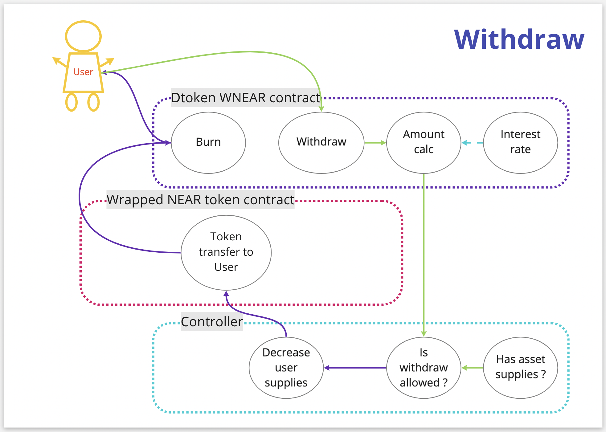

# Deposit & Earning

## How do I deposit

1. Connect your wallet by clicking on the Connect Wallet button on the main page of the application.
2. Find an asset you’d like to supply and click the Supply button. Then, select the amount you wish to deposit in a pop-up window and submit your transaction.
3. Once the transaction is confirmed, your deposit is successfully registered, and you start earning interest on the supplied amount.

## How do I earn?

Once your deposit is registered and supplied, you start getting rewards in dTokens.

All dTokens holders receive incentives that evolve with market conditions. You can learn more about incentivization and earning interest with OMOMO in the Interest Rate Model chapter.

## How does deposit work?

## **Is there any minimum or maximum limit to deposit?**

You can deposit any amount you want, there are no limits. Still, it's important to keep in mind potential transaction fees that will directly influence your deposit amount and final earnings. We highly recommend you consider this when depositing low amounts since transaction fees might be higher than the expected earnings, and your deposit may lose its value.

***

## **How can I withdraw?**

You can withdraw deposited funds anytime.

1. Open the main page of the application.
2. Select the asset you would like to withdraw and click the Supply button.
3. In the pop-up window, go to the Withdraw tab and select the amount of dTokens you wish to withdraw.
4. Submit the transaction and wait a few minutes for confirmation. Check your wallet as you receive the confirmation and find your assets.
5. In case the transaction fails, try again or contact our team.

## How does withdrawal work?

## Can I use my assets as collateral?

After depositing your assets, you can use them as collateral in any way or combination. If you don't want to use a particular asset as collateral, you can disable this feature anytime.
